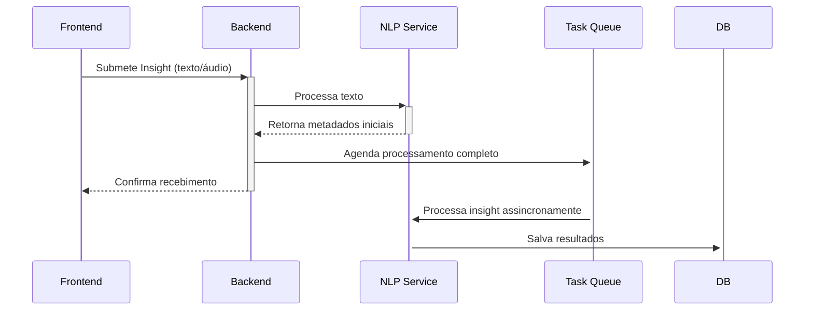
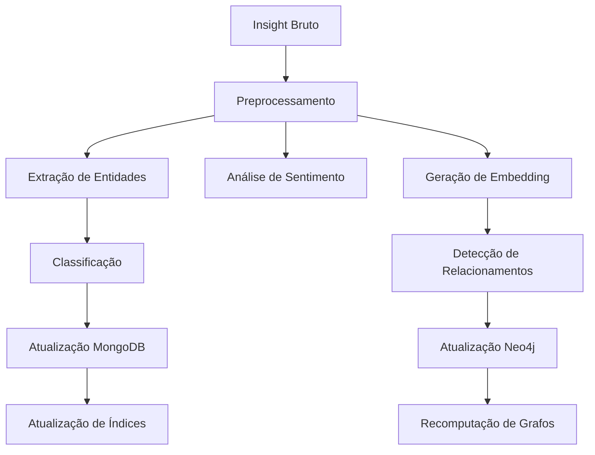
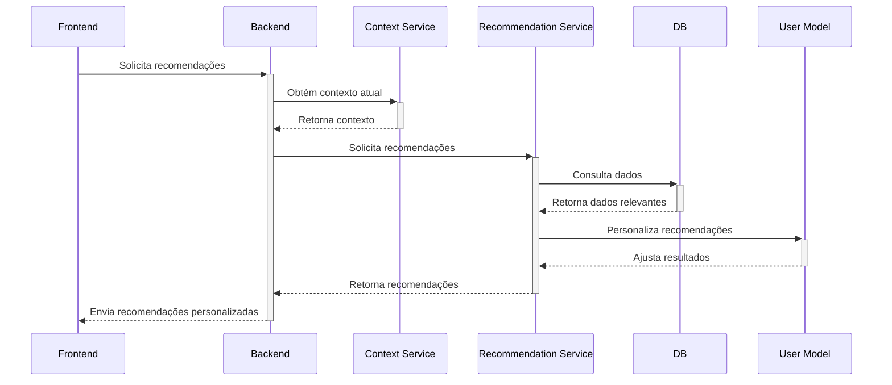
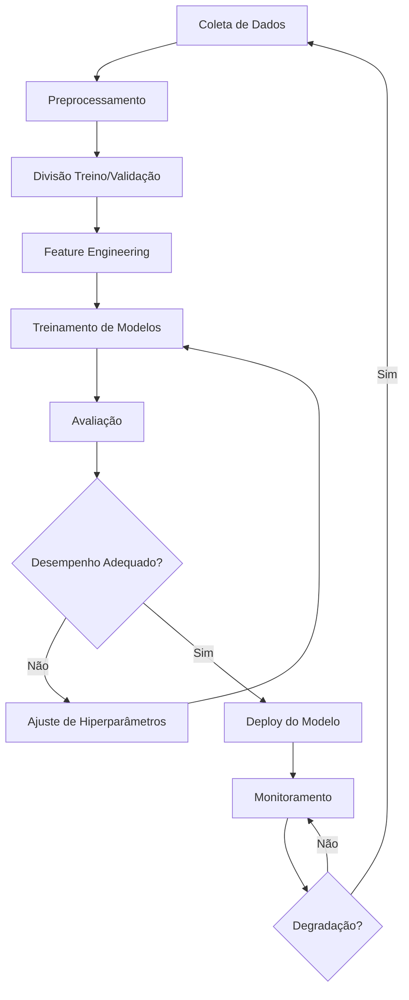

# Plano de Implementação de IA para o Insight Tracker

## Visão Geral

O componente de Inteligência Artificial do Insight Tracker é fundamental para sua proposta de valor, permitindo classificação automática de insights, estabelecimento de relações semânticas, e assistência personalizada. Este documento detalha a estratégia de implementação dos componentes de IA, desde o processamento inicial até o aprendizado contínuo.

## Objetivos do Sistema de IA

1. **Classificação Automática**: Categorizar insights sem intervenção do usuário
2. **Detecção de Relacionamentos**: Identificar conexões semânticas entre insights
3. **Recomendações Contextuais**: Sugerir insights relacionados ao contexto atual
4. **Assistência Personalizada**: Adaptar sugestões ao estilo cognitivo do usuário
5. **Aprendizado Contínuo**: Melhorar progressivamente com base no uso

## Componentes de IA

### 1. Processamento de Linguagem Natural (NLP)

#### Tecnologias Principais
- **spaCy**: Análise linguística básica e extração de entidades
- **Sentence-Transformers**: Geração de embeddings semânticos
- **HuggingFace Transformers**: Modelos pré-treinados para tarefas específicas

#### Funcionalidades
- **Tokenização e Normalização**: Preparação de texto para processamento
- **Extração de Entidades**: Identificação de conceitos-chave
- **Análise de Sentimento**: Detecção de tonalidade emocional
- **Sumarização**: Geração automática de títulos e resumos
- **Vectorização Semântica**: Conversão de texto para representações numéricas

### 2. Sistema de Relacionamentos

#### Tecnologias Principais
- **SciKit-Learn**: Cálculos de similaridade e clustering
- **NetworkX**: Análise de grafos e detecção de comunidades
- **Faiss**: Busca eficiente de similaridade em alta dimensionalidade

#### Funcionalidades
- **Similaridade Coseno**: Medição de proximidade semântica
- **Detecção de Tópicos**: Agrupamento de insights por temas
- **Análise de Grafo**: Identificação de insights centrais e pontes
- **Busca Semântica**: Recuperação de insights relacionados

### 3. Sistema de Recomendação

#### Tecnologias Principais
- **PyTorch**: Framework para modelos de aprendizado profundo
- **LightFM**: Modelo híbrido de recomendação
- **Surprise**: Biblioteca para sistemas de recomendação

#### Funcionalidades
- **Recomendação de Insights**: Sugestão de ideias relacionadas
- **Detecção de Lacunas**: Identificação de áreas subexploradas
- **Sugestão de Conexões**: Proposta de novos relacionamentos
- **Priorização de Insights**: Destaque de ideias potencialmente valiosas

### 4. Assistente Personalizado

#### Tecnologias Principais
- **Ray**: Computação distribuída para treinamento
- **Reinforcement Learning**: Aprendizado por reforço com feedback do usuário
- **PyTorch Lightning**: Estrutura para treinamento de modelos

#### Funcionalidades
- **Modelagem de Usuário**: Captura do estilo cognitivo
- **Adaptação Contextual**: Ajuste de recomendações ao contexto
- **Explanabilidade**: Justificativas para sugestões
- **Feedback Loop**: Aprendizado a partir das interações

## Arquitetura Técnica

```
backend/app/
├── services/
│   ├── nlp/
│   │   ├── preprocessing.py     # Normalização e limpeza de texto
│   │   ├── embeddings.py        # Geração de embeddings
│   │   ├── entities.py          # Extração de entidades
│   │   └── summarizer.py        # Geração de resumos
│   ├── relationships/
│   │   ├── similarity.py        # Cálculos de similaridade
│   │   ├── graph_analysis.py    # Análise de grafo de relacionamentos
│   │   ├── clustering.py        # Agrupamento de insights
│   │   └── search.py            # Busca semântica
│   ├── recommendation/
│   │   ├── content_based.py     # Recomendações baseadas em conteúdo
│   │   ├── collaborative.py     # Filtragem colaborativa (entre usuários)
│   │   ├── hybrid.py            # Abordagem híbrida
│   │   └── ranking.py           # Ordenação de recomendações
│   └── assistant/
│       ├── user_model.py        # Modelagem do perfil do usuário
│       ├── context_aware.py     # Adaptação ao contexto
│       ├── explainer.py         # Geração de explicações
│       └── feedback.py          # Processamento de feedback
├── models/
│   ├── embeddings/              # Modelos de embedding
│   ├── classifiers/             # Modelos de classificação
│   ├── recommenders/            # Modelos de recomendação
│   └── user_profiles/           # Perfis de usuário
└── tasks/
    ├── model_training.py        # Treinamento periódico
    ├── embedding_generation.py  # Geração de embeddings
    └── relationship_detection.py # Detecção de relacionamentos
```

## Fluxo de Processamento

### 1. Captura de Insight



### 2. Processamento Assíncrono



### 3. Recomendação e Assistência



## Estratégia de Treinamento

### Abordagem Inicial

1. **Modelos Pré-treinados**: Utilização de modelos base já treinados em grandes corpora
   - BERT/RoBERTa para embeddings
   - SpaCy para NER e POS tagging
   - SentenceTransformers para similaridade semântica

2. **Configuração de Hiperparâmetros**: Ajuste baseado em dados de benchmark
   - Limiares de similaridade
   - Pesos para diferentes fatores de recomendação
   - Configurações de clustering

3. **Bootstrap com Dados Sintéticos**: Geração de insights e relacionamentos iniciais para treinamento

### Aprendizado Contínuo

1. **Aprendizado Supervisionado**: Baseado em interações explícitas
   - Confirmações ou rejeições de sugestões
   - Criação manual de relacionamentos
   - Ajustes de categorização

2. **Aprendizado Não-Supervisionado**: Baseado em padrões de uso
   - Frequência de acesso a insights
   - Padrões temporais de criação
   - Clusters naturais de tópicos

3. **Aprendizado por Reforço**: Refinamento baseado em resultados
   - Recompensas para sugestões aceitas
   - Penalidades para recomendações ignoradas
   - Adaptação gradual ao comportamento do usuário

## Pipeline de Treinamento



## Métricas de Avaliação

### Classificação
- Precisão, Recall, F1-Score
- Matriz de Confusão
- Cohen's Kappa

### Relacionamentos
- Precisão@K para relacionamentos sugeridos
- Mean Average Precision (MAP)
- Cobertura de tópicos

### Recomendações
- Precision@K e Recall@K
- Normalized Discounted Cumulative Gain (NDCG)
- Diversidade e novidade

### Assistente Personalizado
- Taxa de aceitação de sugestões
- Tempo até primeira interação útil
- Net Promoter Score (NPS)

## Privacidade e Ética

### Proteção de Dados
- Treinamento local no dispositivo quando possível
- Anonimização de dados para treinamento coletivo
- Opção de exclusão (opt-out) de contribuição para melhorias de modelo

### Transparência
- Explicabilidade das recomendações
- Visualização de fatores de decisão
- Controle do usuário sobre intensidade da assistência

### Viés e Fairness
- Monitoramento de viés em recomendações
- Diversidade intencional em sugestões
- Avaliação regular de métricas de fairness

## Requisitos de Hardware

### Desenvolvimento
- CPU: 4+ cores
- RAM: 16GB+
- GPU: NVIDIA com 4GB+ VRAM (para treinamento)
- Armazenamento: 100GB SSD

### Produção
- Instâncias CPU otimizadas para inferência
- Instâncias GPU para treinamento periódico
- Escalabilidade horizontal para múltiplos usuários

## Ferramentas e Serviços Necessários

### Desenvolvimento
- Jupyter Notebooks para experimentação
- Weights & Biases para tracking de experimentos
- Git LFS para versionamento de modelos
- Docker para containerização

### Produção
- MLflow para gerenciamento de ciclo de vida de modelos
- Airflow para orquestração de treinamento
- Prometheus + Grafana para monitoramento
- TensorBoard para visualização de métricas

## Roadmap de Implementação

### Fase 1: Fundação (Meses 1-2)
- Implementação de pipeline básico de NLP
- Geração de embeddings para insights
- Detecção simples de relacionamentos por similaridade
- Configuração de infraestrutura de treinamento

### Fase 2: Capacidades Principais (Meses 3-4)
- Classificação automática de insights
- Detecção de relacionamentos avançada
- Sistema básico de recomendação
- Visualização inicial de grafo

### Fase 3: Personalização (Meses 5-6)
- Modelagem de perfil de usuário
- Recomendações contextuais
- Feedback loop para aprendizado
- Sugestões proativas

### Fase 4: Assistente Avançado (Meses 7-8)
- Assistente conversacional
- Geração de insights complementares
- Detecção de padrões de pensamento
- Explicabilidade avançada

### Fase 5: Refinamento e Escala (Meses 9-12)
- Otimização de performance para múltiplos usuários
- Implementação de aprendizado federado
- Sistemas avançados de segurança e privacidade
- Personalização aprofundada baseada em domínios específicos

## Riscos e Mitigações

| Risco | Impacto | Probabilidade | Mitigação |
|-------|---------|---------------|-----------|
| Desempenho inadequado dos modelos iniciais | Alto | Média | Começar com modelos pré-treinados e ajustar gradualmente |
| Viés nas recomendações | Médio | Alta | Implementar métricas de fairness e diversidade forçada |
| Necessidade computacional excessiva | Alto | Média | Otimizar modelos via quantização e poda; utilizar arquiteturas eficientes |
| Dados insuficientes para treinamento personalizado | Alto | Alta | Implementar técnicas de few-shot learning e transfer learning |
| Privacidade dos dados do usuário | Alto | Média | Treinamento federado e processamento local quando possível |
| Degradação de modelos ao longo do tempo | Médio | Alta | Monitoramento contínuo e retreinamento periódico |